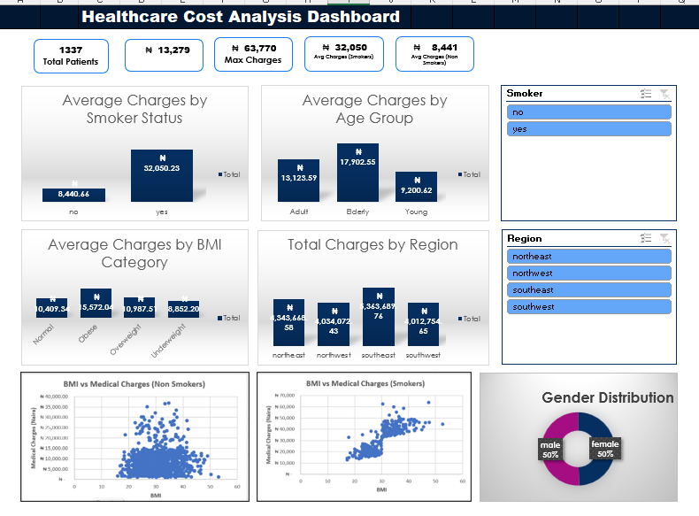
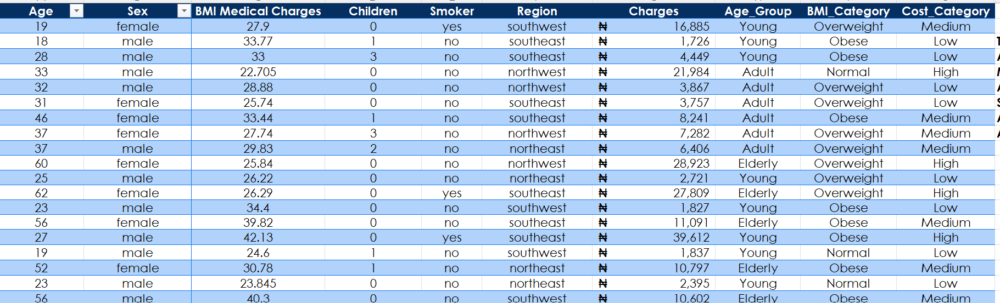
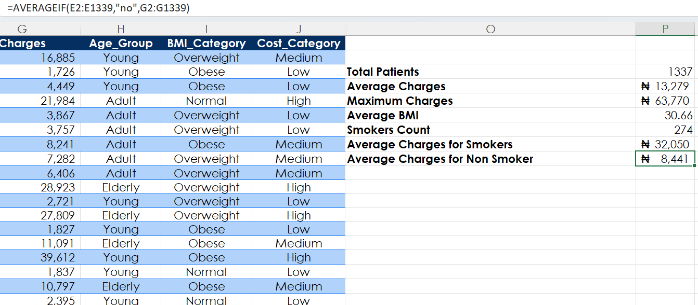

# Healthcare Cost Analysis Dashboard (Excel)

## Project Overview

This project presents an interactive healthcare cost analysis dashboard built using Microsoft Excel. It explores how patient characteristics such as smoking status, BMI, age, and region influence medical charges.

---

## 📂 Project Files

### 🔹 Excel Dashboard File

[Download Excel File](Healthcare-cost-analysis-dashboard.xlsx)

---

## 🖼️ Dashboard Preview

---

## Dataset Description

The dataset includes:

* Age
* Gender
* BMI
* Children
* Smoker status
* Region
* Medical charges

---

## Objectives

* Compare costs between smokers and non-smokers
* Analyze cost trends across age groups
* Evaluate the impact of BMI on medical charges
* Identify regional differences in healthcare expenses
* Explore relationships between BMI and medical charges

---

## Key Metrics (KPIs)

* Total Patients
* Average Charges
* Maximum Charges
* Average Charges (Smokers)
* Average Charges (Non-Smokers)

---

## Dashboard Features

* Average Charges by Smoker Status
* Average Charges by Age Group
* Average Charges by BMI Category
* Total Charges by Region
* Gender Distribution
* Scatter plots: BMI vs Charges (Smokers vs Non-Smokers)
* Interactive slicers

---

## Tools Used

* Microsoft Excel
* Pivot Tables
* Charts
* Slicers

---

## Key Insights

* Smokers incur significantly higher medical charges
* BMI has a stronger impact on costs among smokers
* Adults tend to have higher average medical costs
* Regional differences exist in healthcare expenses
* Gender distribution is relatively balanced

---

## Conclusion

This dashboard provides insights into the key factors influencing healthcare costs and demonstrates how Excel can be used for data analysis and visualization.
